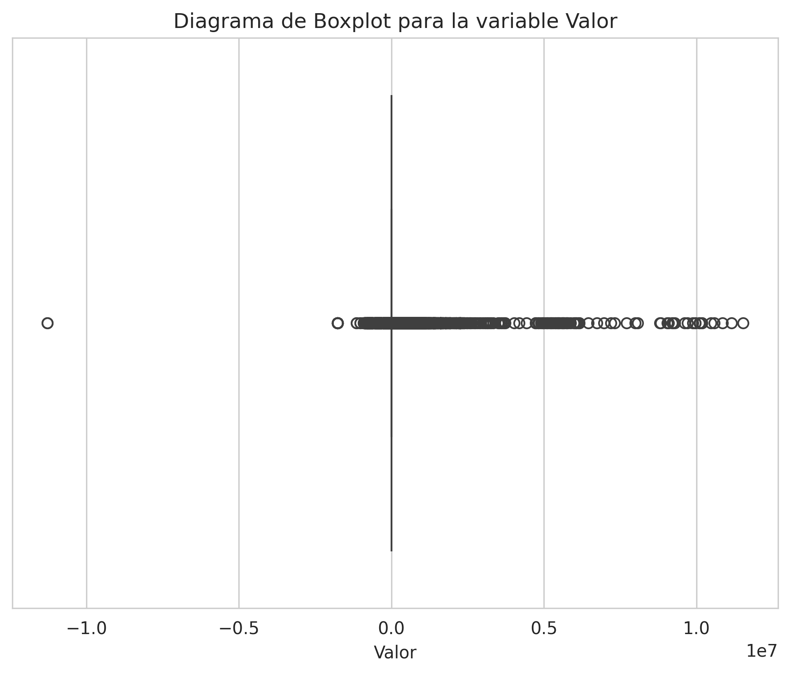
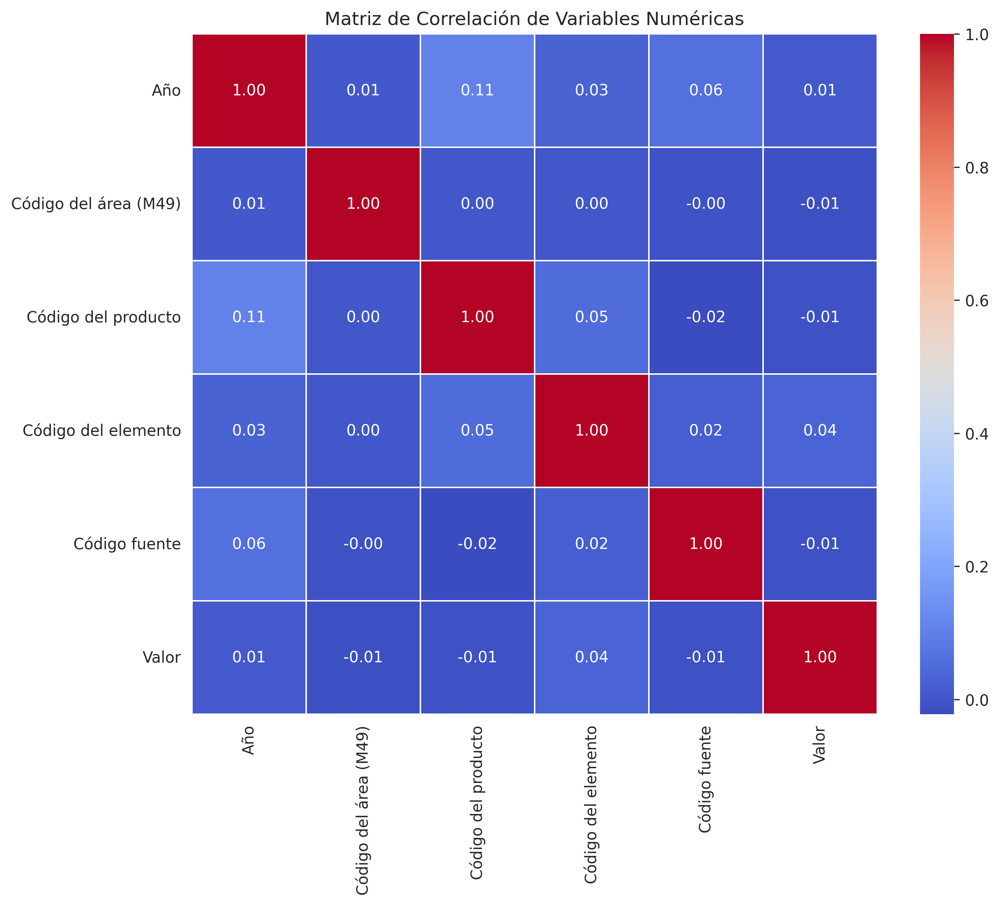
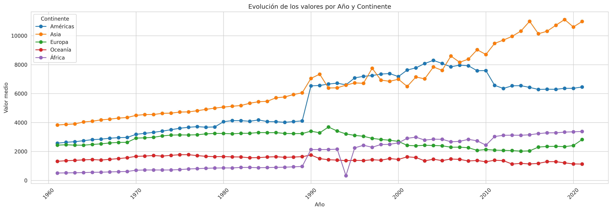
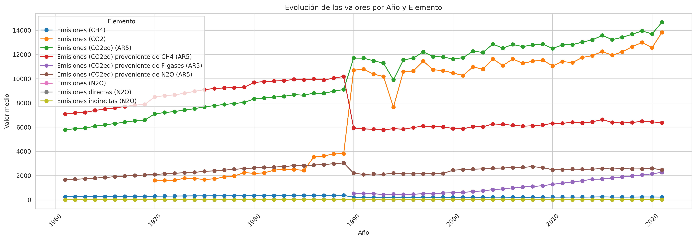
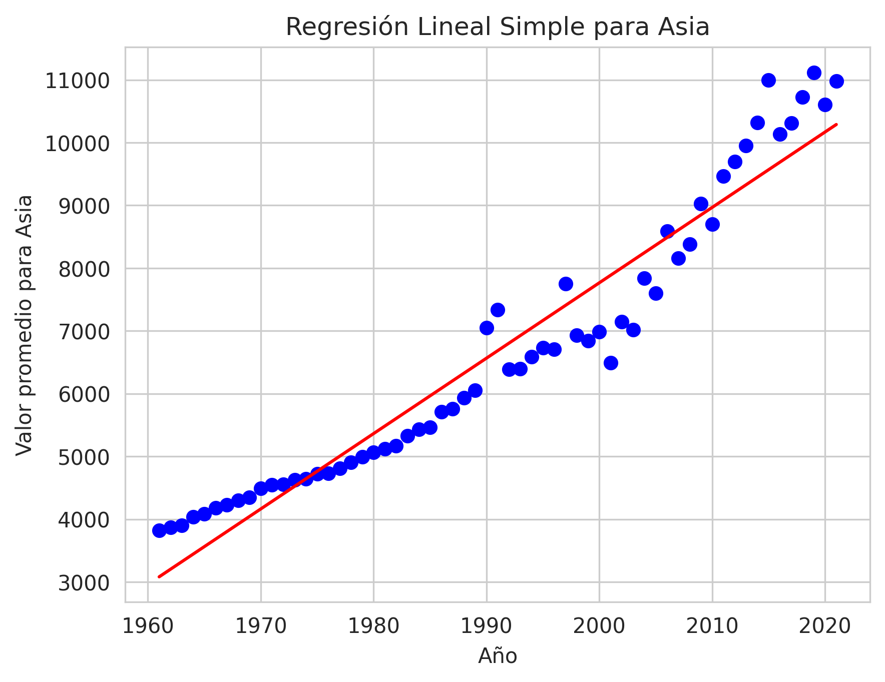
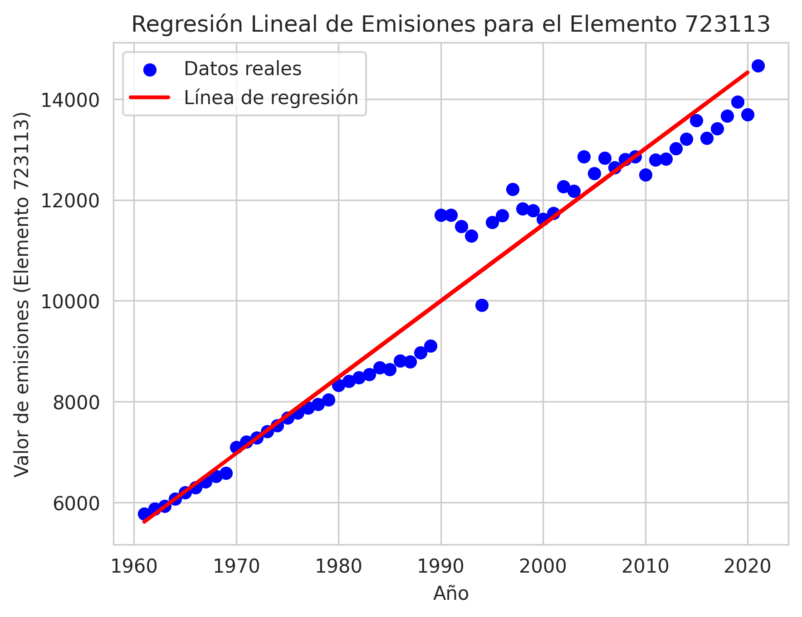

# 🌍 Análisis y Predicción de Emisiones GEI – FAO

Este proyecto analiza el dataset **“Totales de las Emisiones”** de la FAO, que contiene información global sobre emisiones agrícolas de gases de efecto invernadero (GEI) entre 1961 y 2020.  
El objetivo es identificar patrones, tendencias históricas y realizar **modelos predictivos basados en regresión lineal**.

El análisis completo se encuentra en el notebook:

📄 `notebooks/TP3_Practica.ipynb`

---

## 🔍 Objetivos del Proyecto

- Explorar tendencias globales de emisiones agrícolas.
- Comparar continentes, categorías y elementos contaminantes.
- Detectar relaciones entre variables mediante correlaciones.
- Identificar los productos que más contribuyen a las emisiones.
- Construir un modelo de **regresión lineal** para proyección futura.

---

## 🧠 Técnicas y Herramientas Utilizadas

**Python**
- Pandas  
- NumPy  
- Matplotlib / Seaborn  

**Machine Learning**
- Regresión lineal (scikit-learn)

**Análisis**
- EDA completo  
- Limpieza y transformación de datos  
- Matrices de correlación  
- Tendencias por continente y categoría  
- Detección de outliers  
- Comparaciones interregionales  

---

## 📊 Visualizaciones Principales

### 🔹 Boxplot de valores de emisiones


### 🔹 Matriz de correlaciones


### 🔹 Evolución de emisiones por continente


### 🔹 Evolución por tipo de elemento


### 🔹 Regresión lineal — Asia


### 🔹 Regresión — Elemento 723113 (CO₂eq AR5)


### 🔹 Top 5 productos con mayor emisión acumulada


---

## 📈 Resultados Destacados

- **Asia** presenta la tendencia más pronunciada de crecimiento en emisiones agrícolas.
- El elemento **723113 (CO₂ equivalente – AR5)** es el de mayor impacto global.
- La matriz de correlación evidencia relaciones fuertes entre ciertos grupos de emisiones.
- Los **5 productos más contaminantes** concentran una proporción significativa del total.
- El modelo de regresión lineal permite realizar **proyecciones hacia 2030**, mostrando una tendencia alcista moderada.

---

## 📁 Estructura del Repositorio

```text
FAO-Emisiones-ML/
│
├── data/
│   └── raw/                 # Dataset original
│
├── notebooks/
│   └── TP3_Practica.ipynb   # Notebook principal
│
├── img/                     # Gráficos generados
│   └── *.png
│
└── README.md
```

---

## ▶️ Cómo Ejecutar el Proyecto

1. Clonar el repositorio  
2. Abrir el notebook desde Jupyter o Google Colab  
3. Ejecutar las celdas en orden

---

## ✨ Autores

Este proyecto fue realizado en el marco de presentación de ultimo Trabajo Practico de la Materia Ciencia de Datos de la Licenciatura en Ciencia de Datos.

- **Acevedo, David**  
- **Contato, Juan Pablo**  
- **Galeano, Mónica Inés**  
- **Rodriguez, Raúl Matías**

Año: 2024 — Universidad del Gran Rosario  

